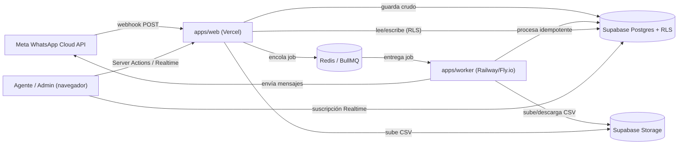

# Arquitectura — Reto WhatsApp

Plataforma interna single-tenant sobre WhatsApp Cloud API. Monorepo con Bun workspaces.

```
apps/
  web/       Next.js 16 (App Router), Tailwind v4, shadcn/ui, Supabase Auth
  worker/    Proceso Node/Bun independiente: BullMQ (webhooks, campañas, plantillas, importaciones)
packages/
  core/      Cliente Graph API, reglas de dominio (idempotencia, ventana 24h, consentimiento, plantillas)
  db/        Tipos TypeScript del esquema de Supabase
supabase/
  migrations/  Esquema SQL versionado + RLS (fuente de verdad)
```

## Diagrama de componentes



## Flujo de un webhook entrante

1. Meta hace `POST /api/webhooks/whatsapp` (`apps/web/src/app/api/webhooks/whatsapp/route.ts`).
2. Se verifica la firma `X-Hub-Signature-256` con `META_APP_SECRET` (`verifyMetaWebhookSignature` en
   `packages/core`).
3. El payload crudo se guarda en `webhook_events` **antes** de cualquier procesamiento, con `dedupe_key` =
   hash del body exacto (evita procesar dos veces una reentrega de Meta).
4. Si la firma es inválida, se responde 401 y no se encola nada (pero el intento queda guardado para auditoría).
5. Si es válida y es una fila nueva, se encola un job `webhook-processing` (BullMQ) con `jobId` = id de la fila.
6. El worker (`apps/worker/src/processors/webhook-processing.ts`) procesa: upsert de contacto, mensaje (único por
   `wamid`), estado de conversación. Un sweeper (`apps/worker/src/sweeper.ts`) reprocesa cada minuto filas
   `processed_at IS NULL` con más de 5 minutos, por si el encolado falló tras guardar.

## Flujo de una campaña

1. **Draft**: se elige plantilla, número emisor y filtro de audiencia (tags incluir/excluir).
2. **Vista previa**: query de solo lectura contra `contacts` (excluye siempre a quien no esté `subscribed`).
3. **Bloquear destinatarios**: el filtro se materializa en `campaign_recipients` (snapshot inmutable) *antes* de
   iniciar el envío. Estado pasa a `recipients_locked`.
4. **Iniciar**: la request solo cambia el estado a `queued` y encola **un** job `campaign-dispatch`. Nunca se
   envía nada en la propia request HTTP.
5. El worker pagina destinatarios pendientes en lotes de 50 (`campaign_batches`) y encola un job `message-send`
   por destinatario, con `jobId = campaignId:contactId` (BullMQ deduplica reintentos del propio dispatch).
6. Cada `message-send` re-valida consentimiento en el momento, renderiza las variables de la plantilla, envía vía
   Graph API con un límite de tasa (8 msg/s por defecto) y reintenta con backoff ante rate-limit de Meta sin
   marcar el destinatario como fallo permanente.
7. Cuando no quedan destinatarios `pending`/`queued`, la campaña se marca `completed` automáticamente.

## Idempotencia (resumen)

| Punto | Mecanismo |
| --- | --- |
| Webhook recibido dos veces | `webhook_events.dedupe_key` único (hash del body) |
| Mensaje entrante duplicado | `messages.wamid` único, `ON CONFLICT DO NOTHING` |
| Evento de estado duplicado/desordenado | `message_status_events.dedupe_key` único + `isForwardStatusTransition` (nunca retrocede, `failed` es terminal) |
| Envío de campaña duplicado | `campaign_recipients` único `(campaign_id, contact_id)` + `jobId` determinístico en BullMQ |
| Reintento de envío manual del agente | `messages.client_dedupe_key` único, generado en el cliente |

## Seguridad

- El token de Meta se cifra (`packages/core/src/security/token-crypto.ts`, AES-256-GCM) antes de guardarse en
  `waba_accounts.access_token_encrypted`, y el rol `authenticated` de Postgres tiene revocado el `GRANT SELECT`
  sobre esa columna (defensa en profundidad además de RLS): solo el service role (usado por el worker y por
  Route Handlers server-only) puede leerla.
- RLS en todas las tablas (`supabase/migrations/`). Los agentes solo ven conversaciones asignadas a ellos/su
  equipo o sin asignar; supervisores/admin ven todo.
- `audit_log` es de solo lectura para `authenticated` salvo inserciones atribuidas al propio usuario; los cambios
  sensibles (rol, asignación, consentimiento, estado de campaña) se auditan automáticamente vía triggers.
- Fuera de la ventana de 24h, el envío de texto libre se bloquea a nivel de servicio
  (`packages/core/src/domain/window.ts`), no solo en la UI, tanto para agentes como para campañas.
